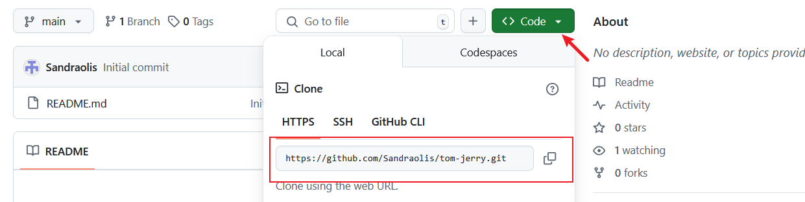
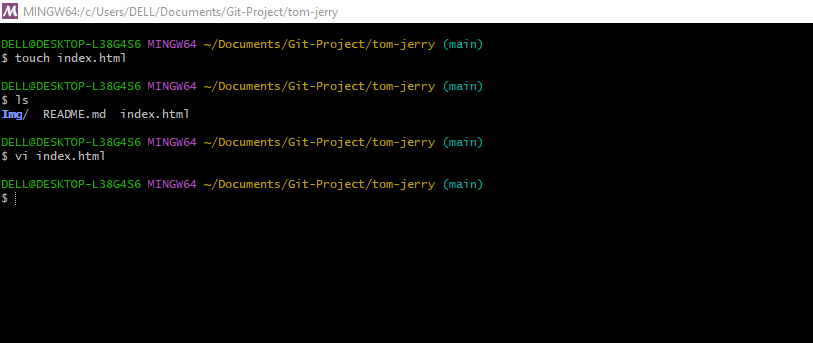
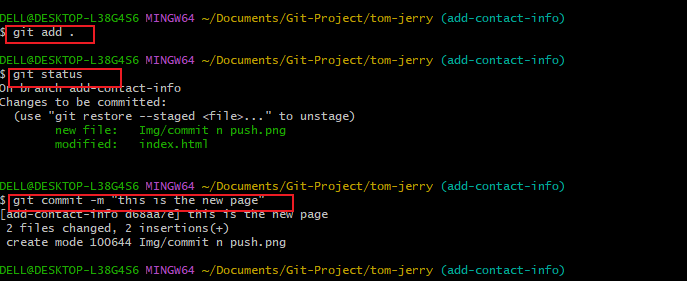
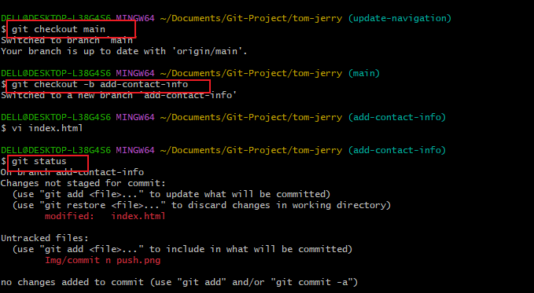

# PART 1: Github Setup and Configuration
This guide will help you through the basics of using GitHub, including installing Git, creating a repository, cloning it, and pushing those changes back to GitHub.

## Install Git:
1. **Download Git**:
- Visit the official website to download
- Click [here](https://git-scm.com/.)
- Download the appropriate version for your operating system (Windows, macOS, or Linux).

2. **Install Git**:
- Follow the installation instructions for your OS `operating system`
- Once installed, open a terminal or command prompt and verify the installation by running this command: 
``` bash
git --version
```
- This should display the installed version of Git


## Login to Github
1. **Create a GitHub Account**:
- Click [here](https://github.com/.) to sign up

2. ## Login to Github:
- Click [here](https://github.com/login) to login using your login details.


# Create Github Repository:
1. ### **Create a new Repository**:
- On GitHub, click the "+" icon or the "New" word in the top-right corner and select "New repository".
- Name the repository `tom-jerry`
- Optionally, add a description.
- Choose "Public" or "Private" visibility.
- Check the box to "Initialize this repository with a README".
- Click "Create repository".


Create Repository

# Clone The Repository:
1. ### Copy the repository URL:

- On the repository page, click on the `Code` button.
- Copy the HTTP URL (eg., https://github.com/your-username/tom-jerry.git). 



2. ### Clone the Repository locally.
- Open your terminal or command prompt.
- Create a folder named *Git_project*, using the below command.
``` bash
mkdir Git-Project
```
- Navigate into the `Git-Project` folder by running the below command.
``` bash
cd Git-Project
```
- Clone the repository by using the copied URL:
``` bash
git clone https://github.com/your-username/tom-jerry.git
```
- Navigate into the cloned repository:
``` bash
cd tom-jerry`
```


# Make Change and Commit.
1. Create a new file:
- Create an empty `index.html` file by using the below command.
``` bash
touch index.html
```
- Add some content to the file using a text editor or IDE.



2. ### Check Git status
- Run the following command to see the changes that have not been staged: 
``` bash
git status`
```


- its showing in red and statimg that it has not be staged, so to stage and track it, we use the command `git add .` and `git status` again to know if it has been staged and tracked.



- The above picture shows that it has been staged and tracked after using the `git add .` command.

3. ### Commit Changes:
 - Commit the changes with a message.
 git commit -m "this is my first commit"

 

 # Push Change To Github
 1. ### push to Github

 - Push the changes to the *main* branch on GitHub:
 - Using this command
 `git push origin main`

  

  2. ### Verify on Github
  - Go to your repository on GitHub and verify that the index.html file has been added.

  

  # PART 2: Simulating Tom and Jerry's Team Work.
This guide will walk you through the basics of using GitHub, including navigating a project directory, creating branches, making changes, pulling lastest changes from the central repository, and collaborating with others. We'll simulate workflows for two contributors, Tom and Jerry.

## Navigating the Project Directory and Checking Branches.
 ### Procedure:
 1. Navigate to the project directory you cloned earlier using the command: 

 `cd tom-jerry`

 2. Check the current branch in the repository using:

  `git branch` command

  This will display all the branches in the repository.

  3. Creat a new branch call `update-navigation` using this command:

  git checkout -b update-navigation

  4. ***Verify the new branch*** by running git branch again. You should see the newly created branch `listed.


  ## Making Changes and Staging Them:

  Procedures:
  1. Open the index.html file in your code editor. Since this file already exists in the main branch, it will also exist in the new branch you created.
  2. Add the following content to the index file.

  This is Tom adding Navigation to the file.

  3. check the status of your file if it has been stage since you added a comment to the index.html file, run this command:

  `git status`

  

  4. You can see from the picture above that the new comment has not bwwn staged, so use the `git add .` command to stage it.

  `git add .`

  5. Confirm the staged changes by running `git status` again. The changes should now be staged and ready to commit.


  ## Commit And Push Changes:
  `git commit -m "update the index.html navigation bar"

  6. Push the Branch to github using this command:
  `git push origin update-navigation`


  # Simulating Jerry's Contribution
  1. Switch back to main branch by running this command.
  *git checkout main*
  2. create a new branch for jerry `add-contact-info`
  git checkout -b add-contact-info
  3. Make necessary changes to the index.html file
  4. check if the changes has been stages by running `git status`

  

  5. Stage the change by running the command `git add .`
  6. Commit it by using the command `git commit -m "This is Jerry commit"
  7. Push it to your github repository by using the command `git push origin add-contact-info.